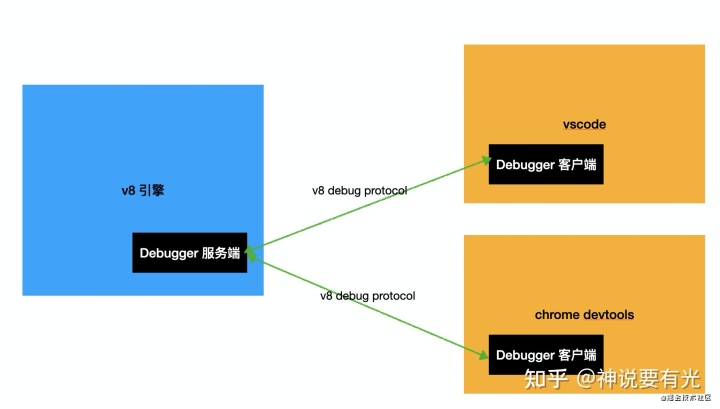
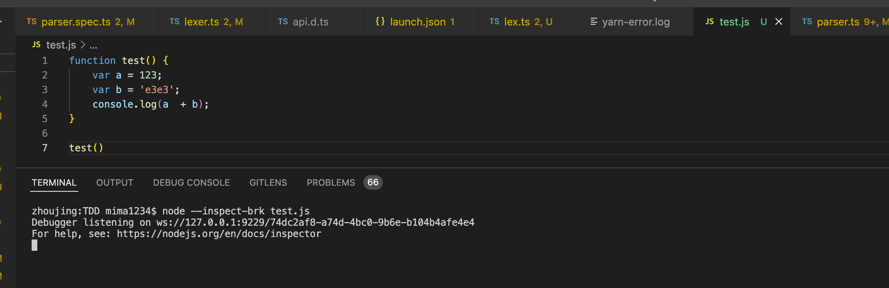
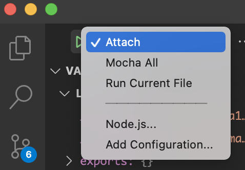
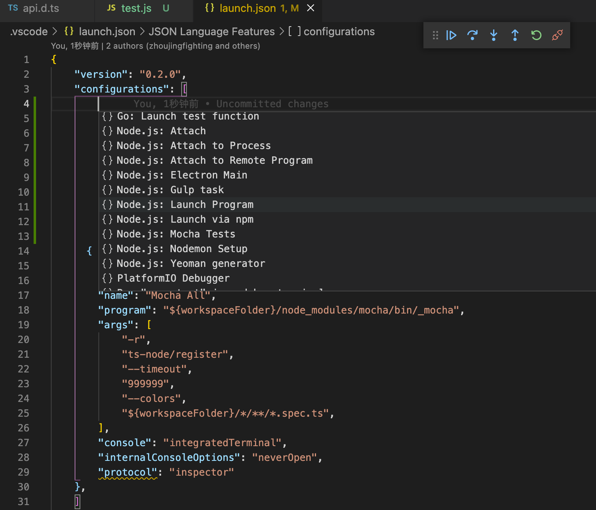
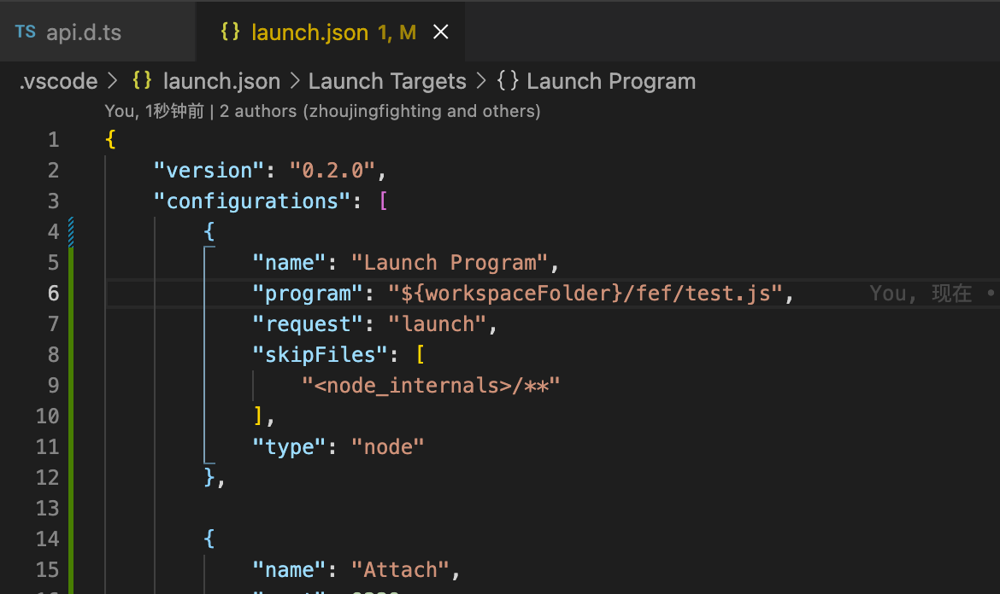

## nodejs debug的重要性
学习 nodejs 最重要的是什么？可能每个人都有自己的答案。我觉得学习 nodejs 除了要掌握基础的 api、常用的一些包外，最重要的能力是学会使用 debugger。因为当流程复杂的时候，断点调试能够帮你更好的理清逻辑，有 bug 的时候也能更快的定位问题。狼叔说过，是否会使用 debugger 是区分一个程序员 nodejs 水平的重要标志。本文分享一下 debugger 的原理和 vscode debugger 的使用技巧。

## 一般debug使用的工具
* vscode debugger
* chrome浏览器

## debugger的原理
运行 nodejs 代码的时候，如果带上了 `--inspect`（可以打断点） 或者 `--inspect-brk`（可以打断点，并在首行断住） 的参数，那么就会以 debugger 的模式启动

> 例子: node --inspect-brk test.js

### 为什么 debugger 要启动一个 websocket server 呢？

debugger 的含义就是要在某个地方断住，可以单步运行、查看环境中的变量。那么怎么设置断点、怎么把当前上下文的变量暴露出去呢，就是通过启动一个`websocket server`，这时候只要启动一个 `websocket client` 连接上这个 server 就可以调试 nodejs 代码了。

### v8 debug protocol

连上之后呢，debugger server 和 debugger client 怎么交流？这就涉及到了 v8 debug protocol。

### debugger client

debugger client 一般都是有 ui 的（当然，在命令行里面通过命令来调试也可以，但一般不这么做）。常见的 js 的`debugger client`有`chrome devtools`和`vscode debugger`等。

写一个简单的js脚本, 通过`node --inspect-brk test.js`跑起来

可以看到他启动在了`9229`端口
可以通过两种client连接上去

#### chrome devtools
在 chrome 地址栏输入 chrome://inspect，然后点击 configure 来配置目标端口：
填上之前看到的端口号：`9229`
> 这个端口号是根据提示得来的 

#### vscode debugger

在 vscode 里面写代码，在 chrome devtools 里调试比较麻烦，vscode 也实现了 debugger 的支持，可以直接用 vscode 来调试。使用vscode 调试能力的方式是修改项目根目录下的 `.vscode/launch.json`配置。

##### attach

点击右下角的按钮来添加一个配置项。这里选择 nodejs 的 attach：

因为已经通过 node --inspect-brk 启动了 websocket 的 debugger server，那么只需要启动 websocket client，然后 attach 上 9229 端口就行

最后点击左侧的启动按钮就可以运行了

##### launch

在根目录`.vscode/launch.json`添加一个 launch 的配置

