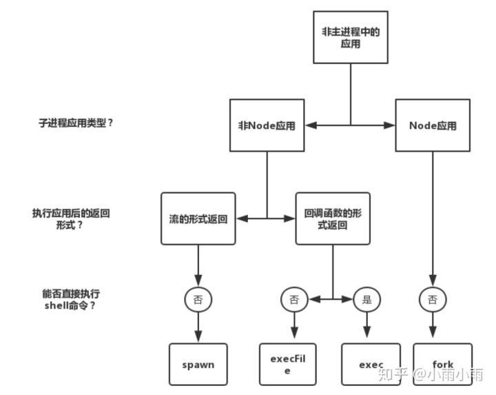

nodejs提供了四个创建进程的方法：
* [exec](http://nodejs.cn/api/child_process.html#child_process_child_process_exec_command_options_callback)
* [execfile](http://nodejs.cn/api/child_process.html#child_process_child_process_execfile_file_args_options_callback)
* [fork](http://nodejs.cn/api/child_process.html#child_process_child_process_fork_modulepath_args_options)
* [spawn](http://nodejs.cn/api/child_process.html#child_process_child_process_spawn_command_args_options)

这些进程之间的关系


> 只有`fork`创建的进程不会自动销毁


```js
//parent.js
const cp = require('child_process');
const n = cp.fork(`${__dirname}/sub.js`);
n.on('message', (m) => {
    console.log('PARENT got message:', m);
});
n.send({ hello: 'world' });

//sub.js
process.on('message', (m) => {
    console.log('CHILD got message:', m);
});
process.send({ foo: 'bar' });
```