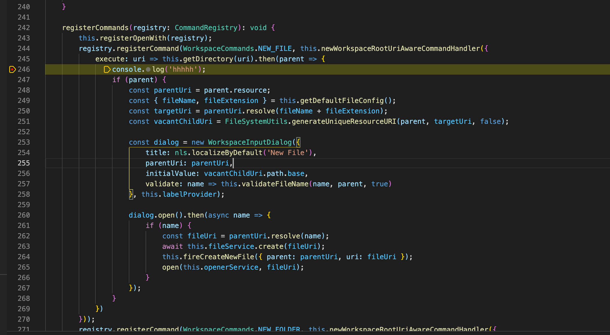

## 下载最新的theia版本

[下载地址](https://github.com/eclipse-theia/theia/tree/v1.24.0)
以上是theia官方github的链接，所以可以直接看到最新的版本

## debug的姿势

有点复杂，现在只能大概说一下

* 打开debug模块， `Launch electron backend and frontend`
* 例如你非常确定自己是调用了什么函数啥的，你就在那里打个断点啥的，以`New file` 为例
  
  在打开theia之后,随便找个文件夹区域触发`New file`命令， 就会跳转到这个断点处！