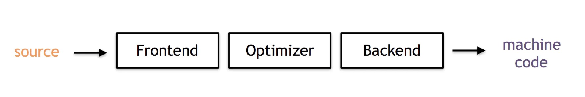
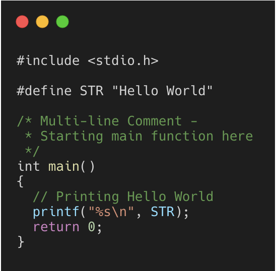
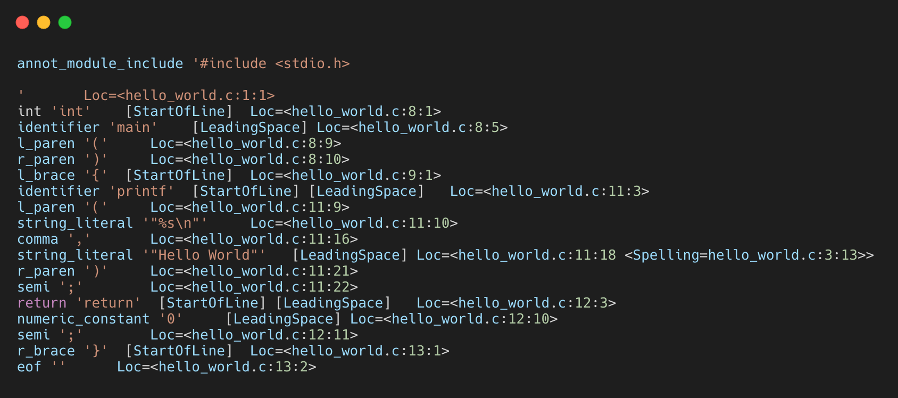
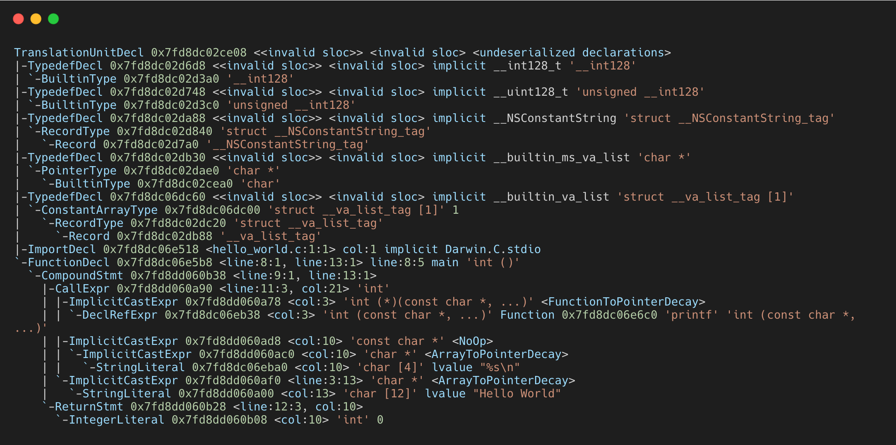
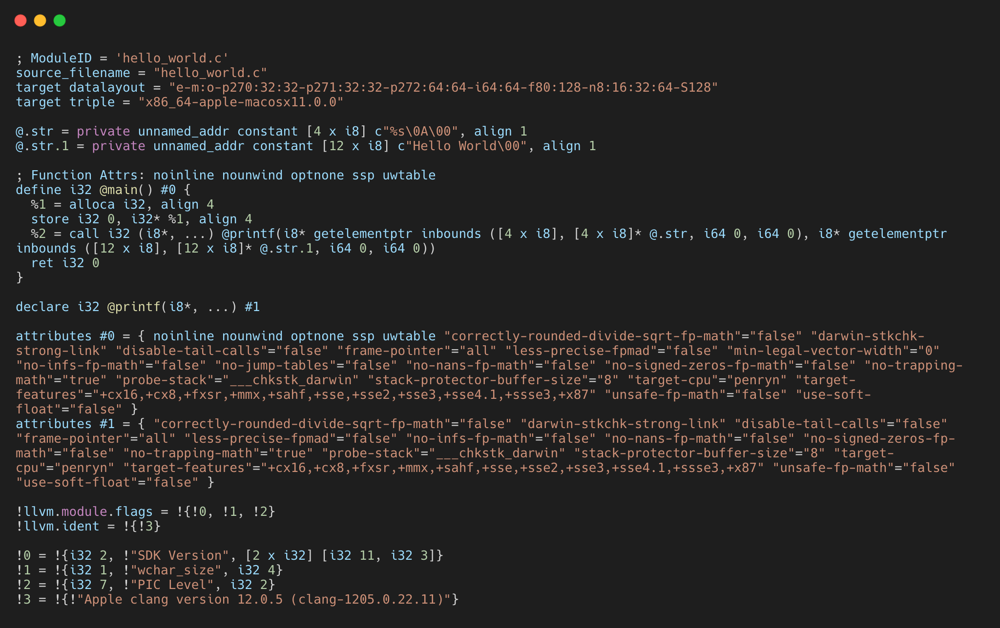

# 编译器

> **编译器**（`compiler`）是一种计算机程序，它会将某种编程语言写成的源代码（原始语言）转换成另一种编程语言（目标语言）。[引自维基百科](https://links.jianshu.com/go?to=https%3A%2F%2Fzh.wikipedia.org%2Fwiki%2F%E7%B7%A8%E8%AD%AF%E5%99%A8)

传统编译器的架构，一般分三部分：

- 前端（`Frontend`）：解析源代码，检查源代码是否有错误，并构建特定语言的抽象语法树（`Abstract Syntax Tree`缩写:`AST`）来表示输入的代码。也负责选择性的地将`AST`转换为新的表示形式以进行优化。
- 优化器（`Optimizer`）：负责进行各种转换，以尝试改善代码的运行时间，例如消除冗余计算，并且通常或多或少地独立于编程语言和目标代码。
- 后端（`Backend`）：也称代码生成器，将代码映射到目标架构的指令集上；其常见部分有：指令选择，寄存器分配，指定调度。




## clang编译的过程

主要是分为四步，

- Preprocessor(预处理)
- Compiler(编译)
- Assembler(汇编)
- Linker(链接器)

### 预处理过程

基于输入，通过预处理器执行一系列的文本转换与文本处理。预处理器是在真正的编译开始之前由编译器调用的独立程序。

```bash
zhoujing:practice mima1234$ touch hello_world.c
zhoujing:practice mima1234$ vim hello_world.c 
zhoujing:practice mima1234$ clang -E hello_world.c  > hello_world.i
```



最终可以在文件夹中看到新生成的`hello_world.i`文件，一共有700多行

预处理的任务：

- 将输入文件读到内存，并断行；
- 替换注释为单个空格；
- `Tokenization`将输入转换为一系列预处理`Tokens`；
- 处理`#import`、`#include`将所引的库，以递归的方式，插入到`#import`或`#include`所在的位置；
- 替换宏定义；
- 条件编译，根据条件包括或排除程序代码的某些部分；
- 插入行标记；

#### 词法分析

词法分析属于预处理部分，词法分析的整个过程，主要是按照：标识符、 数字、字符串文字、 标点符号，将我们的代码分割成许多字符串序列，其中每个元素我们称之为`Token`，整个过程称为`Tokenization`。

**终端输入：**

```bash
# -fmodules: Enable the 'modules' language feature
# -fsyntax-only, Run the preprocessor, parser and type checking stages
#-Xclang <arg>: Pass <arg> to the clang compiler
# -dump-tokens: Run preprocessor, dump internal rep of tokens
zhoujing:practice mima1234$ clang -fmodules -fsyntax-only -Xclang -dump-tokens hello_world.c
```

下面就是分析结果的输出



词法分析中`Token`包含信息（详请见[此处](https://links.jianshu.com/go?to=https%3A%2F%2Fbcain-llvm.readthedocs.io%2Fprojects%2Fclang%2Fen%2Flatest%2FInternalsManual%2F%23the-token-class)）：

- `Sourece Location`：表示`Token`开始的位置，比如：`Loc=<main.m:11:5>`；
- `Token Kind`：表示`Token`的类型，比如：`identifier`、`numeric_constant`、`string_literal`；
- `Flags`：词法分析器和处理器跟踪每个`Token`的基础，目前有四个`Flag`分别是：

1. `StartOfLine`：表示这是每行开始的第一个`Token`；
2. `LeadingSpace`：当通过宏扩展`Token`时，在`Token`之前有一个空格字符。该标志的定义是依据预处理器的字符串化要求而进行的非常严格地定义。
3. `DisableExpand`：该标志在预处理器内部使用，用来表示`identifier`令牌禁用宏扩展。
4. `NeedsCleaning`：如果令牌的原始拼写包含三字符组或转义的换行符，则设置此标志。

### 编译过程

#### 语法分析(parsing)与语义分析

此阶段对输入文件进行[语法分析](https://links.jianshu.com/go?to=https%3A%2F%2Fzh.wikipedia.org%2Fwiki%2F%E8%AF%AD%E6%B3%95%E5%88%86%E6%9E%90)，将预处理器生成的`Tokens`转换为语法分析树；一旦生成语法分析树后，将会进行语义分析，执行类型检查和代码格式检查。这个阶段负责生成大多数编译器警告以及语法分析过程的错误。最终输出`AST`（抽象语法树）

> 所谓 parser，一般是指把某种格式的文本（字符串）转换成某种数据结构的过程。最常见的 parser，是把程序文本转换成编译器内部的一种叫做“抽象语法树”（AST）的数据结构。摘自[对 Parser 的误解-王垠](https://links.jianshu.com/go?to=http%3A%2F%2Fwww.yinwang.org%2Fblog-cn%2F2015%2F09%2F19%2Fparser)

**终端输入：**

```bash
# -fmodules: Enable the 'modules' language feature
# -fsyntax-only, Run the preprocessor, parser and type checking stages
#-Xclang <arg>: Pass <arg> to the clang compiler
# -ast-dump: Build ASTs and then debug dump them
zhoujing:practice mima1234$ clang -fmodules -fsyntax-only -Xclang -ast-dump hello_world.c
```

会得到如下结果



`Clang`的`AST`是从[TranslationUnitDecl](https://links.jianshu.com/go?to=https%3A%2F%2Fclang.llvm.org%2Fdoxygen%2Fclassclang_1_1TranslationUnitDecl.html)节点开始进行递归遍历的；`AST`中许多重要的`Node`，继承自`Type`、`Decl`、`DeclContext`、`Stmt`。

- [Type](https://links.jianshu.com/go?to=https%3A%2F%2Fclang.llvm.org%2Fdoxygen%2Fclassclang_1_1Type.html) ：表示类型，比如`BuiltinType`
- [Decl](https://links.jianshu.com/go?to=https%3A%2F%2Fclang.llvm.org%2Fdoxygen%2Fclassclang_1_1Decl.html) ：表示一个声明`declaration`或者一个定义`definition`，比如：变量，函数，结构体，`typedef`；
- [DeclContext](https://links.jianshu.com/go?to=https%3A%2F%2Fclang.llvm.org%2Fdoxygen%2Fclassclang_1_1DeclContext.html) ：用来声明表示上下文的特定`decl`类型的基类；
- [Stmt](https://links.jianshu.com/go?to=https%3A%2F%2Fclang.llvm.org%2Fdoxygen%2Fclassclang_1_1Stmt.html) ：表示一条陈述`statement`;
- [Expr](https://links.jianshu.com/go?to=https%3A%2F%2Fclang.llvm.org%2Fdoxygen%2Fclassclang_1_1Expr.html)：在`Clang`的语法树中也表示一条陈述`statements`;

#### 代码优化与生成

这个阶段主要任务是将`AST`转换为底层中间的代码`LLVM IR`，并且最终生成机器码；期间负责生成目标架构的代码以及优化生成的代码。最终输出`.s`文件（汇编文件）。

`LLVM IR`有三种格式：

- 文本格式：`.ll`文件
- 内存中用以优化自身时，执行检查和修改的数据结构（编译过程中载入内存的形式）
- 磁盘二进制（`BitCode`）格式：`.bc`文件

`LLVM`提供了`.ll`与`.bc`相互转换的工具：

- `llvm-as`：可将`.ll`转为`.bc`
- `llvm-dis`：可将`.bc`转为`.ll`

**终端输入：**

```bash
# -S : Run LLVM generation and optimization stages and target-specific code generation,producing an assembly file
# -fobjc-arc : Synthesize retain and release calls for Objective-C pointers
# -emit-llvm : Use the LLVM representation for assembler and object files
# -o <file> : Write output to <file>
# 汇编表示成.ll文件 -fobjc-arc 可忽略，不作代码优化
zhoujing:practice mima1234$ clang -fobjc-arc -emit-llvm -S hello_world.c -o hello_world.ll
```

**输出结果：**



当然，这个还可以加入命令行参数进行优化

```
Clang`代码优化参数有`-O0`、 `-O1`、 `-O2`、 `-O3`、 `-Ofast`、`-Os`、 `-Oz` 、`-Og`、 `-O`、`-O4
```

- `-O0`:表示没有优化；编译速度最快并生成最可调试的代码
- `-O1`:优化程度介于`-O0`~`-O2`之间。
- `-O2`:适度的优化水平，可实现最优化
- `-O3`:与`-O2`相似，不同之处在于它优化的时间比较长，可能会生成更大的代码
- `-O4`:当前等效于`-O3`
- `-Ofast`:启用`-O3`中的所有优化并且可能启用一些激进优化
- `-Os`:与`-O2`一样，具有额外的优化功能以减少代码大小
- `-Oz`:类似于`-Os`，进一步减小了代码大小
- `-Og`:类似`-O1`
- `-O`:相当于`-O2`